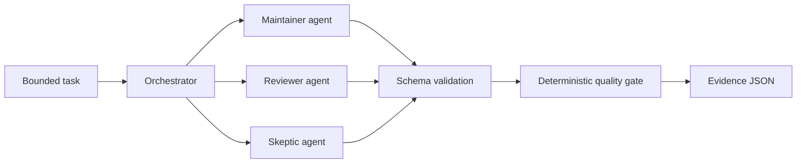

# Architecture

LionelOS separates four concerns:

1. **Task contract** — a small objective, explicit context and constraints.
2. **Provider boundary** — every backend implements `run(agent, task)` and returns the same
   validated verdict, summary and finding shape.
3. **Orchestration policy** — minimum participation, approval threshold, fail-closed provider
   handling and severity gates are deterministic Python rules rather than model judgments.
4. **Evidence** — a normalized report is atomically written and bound to its decision and provider
   results by SHA-256.
5. **Change policy** — proposed paths and before/after digests are checked against an explicit
   allowlist. Authorization is separated from execution; v0.1 never applies the change.

## Trust boundaries

Provider output is untrusted. LionelOS accepts only the documented JSON shape and known enum
values. Transport exceptions do not become abstentions; by default they block the run. Provider
credentials remain outside configuration files. The current public runtime does not expose any
write operation, shell interpolation or model-selected command.

## Extending providers

Adapters own transport only. They must bound input and output, avoid shell evaluation, suppress
credential-bearing errors, and return a validated `ProviderResult`. Decisions remain in the
orchestrator so adding a provider cannot weaken the quality gate.
